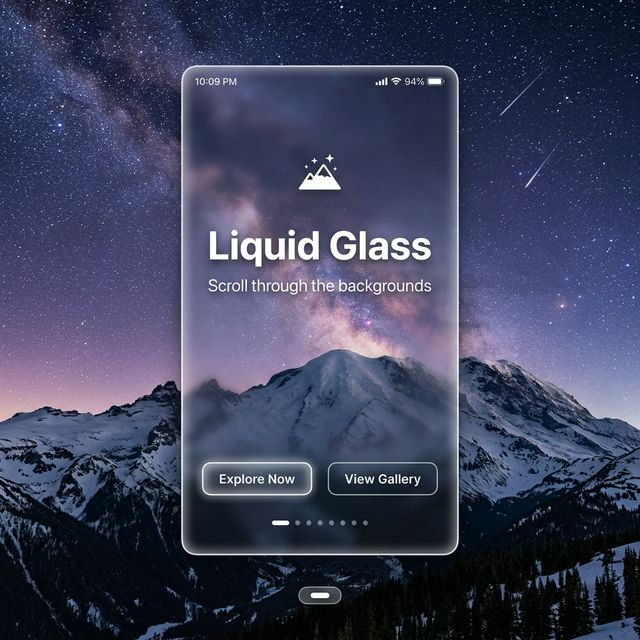

# Liquid Glass Effect

A realistic frosted glass UI component for React with chromatic aberration, edge refraction, and spring physics.



## Features

- **Frosted Glass** — Backdrop blur + saturation via CSS `backdrop-filter`
- **Edge Refraction** — SVG displacement maps for realistic light bending at edges
- **Chromatic Aberration** — Color channel splitting for lens-like distortion
- **Spring Physics** — Elastic deformation and follow-cursor movement
- **Shimmer Border** — Dynamic gradient borders that respond to mouse position
- **Cross-Browser** — Graceful fallback for Safari/Firefox (CSS shimmer overlay)
- **Hover & Press States** — Built-in interactive highlights for clickable elements

## Quick Start

```bash
git clone https://github.com/Leonxlnx/liquid-glass-demo.git
cd liquid-glass-demo
npm install
npm run dev
```

## Usage

```tsx
import GlassLayer from './glass-effect'

// Basic glass card
<GlassLayer
  displacementScale={50}
  blurAmount={0.05}
  saturation={115}
  aberrationIntensity={1}
  cornerRadius={20}
  padding="40px 56px"
  style={{ position: 'fixed', top: '50%', left: '50%' }}
>
  <h1>Hello Glass</h1>
</GlassLayer>

// Clickable glass button
<GlassLayer
  displacementScale={0}
  blurAmount={0.06}
  cornerRadius={999}
  padding="22px"
  onClick={() => console.log('clicked')}
>
  <span>Click me</span>
</GlassLayer>
```

## Props

| Prop | Type | Default | Description |
|------|------|---------|-------------|
| `displacementScale` | `number` | `70` | SVG displacement intensity (0 = no refraction) |
| `blurAmount` | `number` | `0.0625` | Backdrop blur multiplier (×32px) |
| `saturation` | `number` | `140` | Backdrop color saturation (%) |
| `aberrationIntensity` | `number` | `2` | Chromatic aberration strength |
| `elasticity` | `number` | `0.15` | Spring physics stiffness |
| `cornerRadius` | `number` | `999` | Border radius in px (999 = pill/circle) |
| `padding` | `string` | `"24px 32px"` | Inner padding |
| `overLight` | `boolean` | `false` | Dims backdrop for bright backgrounds |
| `onClick` | `() => void` | — | Makes element clickable with hover/press states |
| `style` | `CSSProperties` | `{}` | Position the element (use `position: fixed` + `top/left`) |
| `mode` | `DisplacementMode` | `"standard"` | `"standard"` or `"shader"` displacement mode |

## File Structure

```
src/glass-effect/
├── index.tsx             # Main GlassLayer component (physics, shimmer borders)
├── glass-surface.tsx     # FrostedSurface (backdrop-filter + SVG filter)
├── svg-filter.tsx        # SVG displacement & aberration filter
├── shader-engine.ts      # Procedural displacement map generator
├── displacement-maps.ts  # Pre-built SVG displacement maps
├── interaction-physics.ts # Spring physics & elastic deformation
├── browser-detect.ts     # Chromium/Safari/Firefox detection
├── shimmer-overlay.tsx   # CSS fallback for non-Chromium browsers
└── types.ts              # TypeScript interfaces
```

## Tips

- Use `displacementScale={0}` for small/circular elements to avoid SVG filter artifacts
- Use `position: 'fixed'` with `top/left` in the `style` prop for positioning
- Pass a `mouseContainer` ref to track mouse across a larger area
- Set `cornerRadius={999}` for circular glass buttons

## Tech Stack

- React 19 + TypeScript
- Vite
- SVG Filters (`feDisplacementMap`, `feComponentTransfer`)
- CSS `backdrop-filter`

## License

MIT
